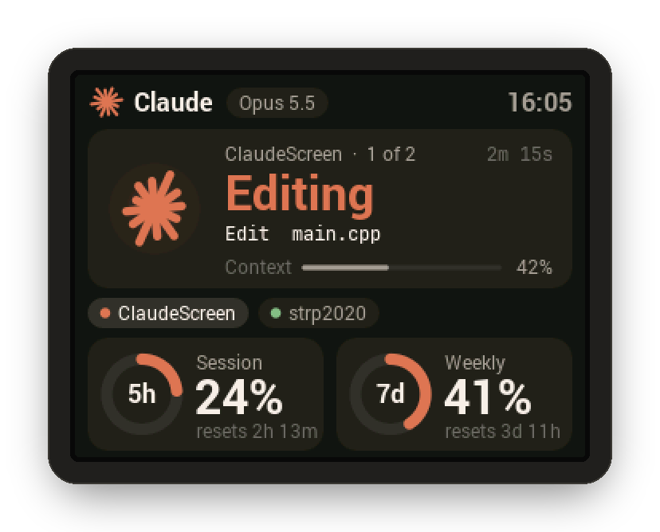
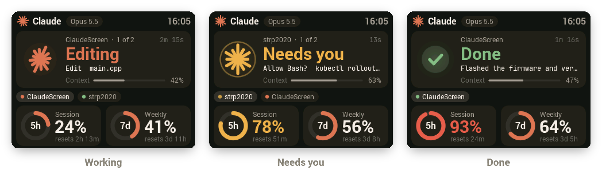
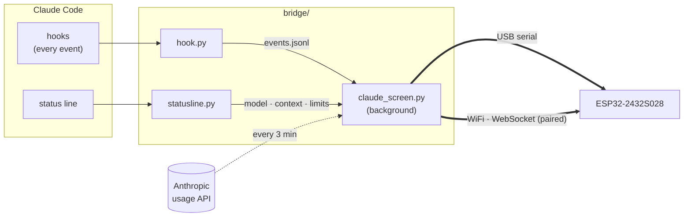

<div align="center">



# ClaudeScreen

**A desk display for Claude Code.** See what Claude is doing, when it needs you,
and how much of your plan you've used, on a $15 ESP32 touchscreen.


[](https://github.com/Alexr03/ClaudeScreen/actions/workflows/build.yml)
[](https://github.com/Alexr03/ClaudeScreen/releases/latest)

</div>

---

## What it shows

<p align="center">
  
</p>

| | |
|---|---|
| **Activity** | The most urgent session up front: *Thinking*, *Editing*, *Running*, *Searching*, *Researching*… with the tool and file or command it's on, and how long it has been at it. |
| **Needs you** | Permission prompts and questions turn the card amber with a pulsing ring, and the LED on the back of the board breathes amber too. |
| **Done** | A green check and the first line of Claude's reply. |
| **Sessions** | One chip per open Claude Code session, coloured by state. Tap the screen to cycle through them. |
| **Context** | How full the focused session's context window is. |
| **Plan usage** | 5-hour and weekly limits as rings, with time until each resets. They turn amber at 75% and red at 90%. |
| **USB or WiFi** | Plug it into your PC, or put it anywhere on your WiFi. One screen can follow several PCs (desktop + laptop), and in a shared house every screen only listens to the PCs paired with it. |

Text is anti-aliased with Roboto and JetBrains Mono, the spark animates while Claude
works, and the backlight dims itself after 10 quiet minutes.

## How it works



- **`hook.py`** runs async on every Claude Code hook event (prompt, tool use, permission
  request, stop…) and appends a compact line to `~/.claude/claude-screen/events.jsonl`.
  It never blocks or slows Claude Code.
- **`statusline.py`** sits in front of your status line, saving the model, context % and
  rate limits Claude Code passes it, then hands off to your original status line command.
- **`claude_screen.py`** turns those events into per-session state, checks plan usage
  every 3 minutes, and streams a JSON line to the board each second: over USB if it's
  plugged in, and over WiFi to every screen this PC is paired with. It reconnects to
  either on its own.
- **The firmware** draws each frame in 40-pixel strips into two alternating buffers, so a
  full 16-bit frame never has to fit in RAM and each strip is sent to the screen (by DMA)
  while the next one is drawn.

## Hardware

- **ESP32-2432S028**, the "Cheap Yellow Display": 2.8" 320×240 touchscreen.
  Both screen controllers sold under that name are supported: ILI9341 and ST7789 ("CYD2USB").
- A USB cable to your PC, or any USB charger if the screen is on WiFi.

> [!NOTE]
> Many of these boards can't draw power from a USB-C port with a USB-C to USB-C cable,
> because the two resistors that tell the port to turn on are missing. Plug into USB-A,
> or use a USB-C to USB-A adapter.

## Setup

### 1. Flash the firmware

**From a release (no build tools needed):** download `claudescreen-<version>-full.bin` from the
[latest release](https://github.com/Alexr03/ClaudeScreen/releases/latest), then:

```bash
pip install esptool
python -m esptool --chip esp32 write-flash 0x0 claudescreen-<version>-full.bin
```

**From source:**

```bash
pip install platformio
cd firmware
pio run -t upload
```

If flashing says *"Wrong boot mode detected"*, hold the **BOOT** button while it connects.

### 2. Install the bridge

```bash
pip install -r bridge/requirements.txt
python bridge/install.py
```

This:
- adds async hooks to `~/.claude/settings.json`, backing it up first
- puts the status line tap in front of your existing status line
- adds a hidden launcher to your Windows Startup folder, so the bridge runs at login

Run `python bridge/install.py --remove` to undo all of it.

### 3. Connect over WiFi (optional)

Skip this if the screen stays plugged into your PC.

**Get it on WiFi**, either way:
- **From your phone:** power the screen from a charger. With no WiFi saved and no PC on USB,
  after 20 seconds it shows **Set up WiFi** with a network name and password. Join it and
  pick your WiFi on the page that opens (or browse to `192.168.4.1`).
- **Over USB:** stop the bridge, then
  `python bridge/display_config.py wifi_ssid="Home" wifi_pass="..."`

**Pair your PC with it:**

```bash
python bridge/claude_screen.py pair
```

The bridge lists the screens it can find on the network; pick yours and type in the
6-digit code it displays. That's it: the bridge now sends to it whenever both are on the
network. Pair your other PCs the same way.

> [!TIP]
> In a house with several screens, give yours a name first so it's easy to pick out:
> `python bridge/display_config.py name="Alex's screen"`

<details>
<summary><b>How pairing protects the screens</b></summary>

Each screen accepts updates only from PCs that have paired with it. Pairing needs the code
shown on that screen, and gives the PC its own random key, stored on the screen and in
`~/.claude/claude-screen/screens.json`. Every connection starts with a fresh challenge the
PC must sign with that key, so a key can't be replayed, and other bridges on the network
can't show anything on your screen.

What it doesn't do is encrypt the updates themselves: someone capturing traffic on your
WiFi could read the session names and commands being sent. `display_config.py unpair`
(over USB) makes the screen forget every PC.
</details>

### 4. Tune the display (if needed)

The firmware tries to detect the panel. If colours look inverted or the picture is
mirrored, change the settings stored on the board. Stop the bridge first:

```bash
python bridge/display_config.py panel=2 inv=1
```

| Setting | Values |
|---|---|
| `panel` | `0` auto · `1` ILI9341 · `2` ST7789 |
| `inv` | `0` auto · `1` normal colours · `2` inverted |
| `rot` | `1` landscape · `3` landscape, flipped (also in the settings menu) |
| `bgr` | `1` swaps red and blue |
| `name` | what the screen is called when pairing |
| `wifi_ssid` / `wifi_pass` | join a WiFi network · `forget_wifi=1` forgets it |

## On the device

- **Tap** to cycle through sessions.
- **Hold for a second** to open **Settings** (drag to scroll):

  | | |
  |---|---|
  | WiFi | the network it's on; tap to forget it, or to start WiFi setup |
  | Paired PCs | how many; tap to forget them all |
  | Brightness | 100% · 70% · 40% |
  | Status light | the RGB LED on the back: on (pulses amber when Claude needs you) or off |
  | Rotate screen | flip 180° |
  | Factory reset | forgets WiFi, paired PCs and settings |

  The first time, it asks you to tap four corner markers, which calibrates the touchscreen.
- **Factory reset without the touchscreen:** hold the **BOOT** button for 5 seconds while
  it's running. Both kinds of reset keep the display settings (`panel`, `inv`, `bgr`) and the
  touch calibration, so the screen stays readable afterwards.

The screen dims itself after 10 quiet minutes and the LED on the back pulses amber while
Claude is waiting for you.

## Updating the firmware

Once a screen is on WiFi and paired, update it from your PC with no cable or BOOT button:

```bash
python bridge/claude_screen.py update                 # latest release from GitHub
python bridge/claude_screen.py update firmware.bin    # your own build
```

It updates every paired screen it can find (`--screen <name>` picks one), and the screen
shows a progress bar. The bridge gives the screen a one-time password over the paired
connection, so only PCs paired with a screen can update it.

## Usage

| Command | |
|---|---|
| `python bridge/claude_screen.py` | Run the bridge in a terminal (it normally starts at login) |
| `python bridge/claude_screen.py pair` | Pair with a screen on the network |
| `python bridge/claude_screen.py screens` | List screens on the network and which are paired |
| `python bridge/claude_screen.py unpair <name>` | Forget a screen |
| `python bridge/claude_screen.py update [file]` | Update paired screens' firmware over WiFi |
| `python bridge/claude_screen.py --demo` | Cycle through demo screens |
| `python bridge/claude_screen.py --shot out.png` | Save a screenshot of what's on the display |
| `python bridge/display_config.py` | Show the settings stored on the board (over USB) |

The background bridge logs to `~/.claude/claude-screen/bridge.log`.

### About the usage rings

The 5-hour and weekly numbers come from two places, and whichever is newer wins:

1. **The status line.** Claude Code passes rate limits to it in terminal sessions.
2. **Claude Code's usage endpoint**, checked every 3 minutes with the login token in
   `~/.claude/.credentials.json`. The token is only sent to `api.anthropic.com`. That file
   is only refreshed by terminal `claude` sessions, so if you only use the desktop app the
   rings show the last known values until you next run `claude` in a terminal.

The endpoint isn't officially documented, so a Claude Code update could change it.

## Project layout

```
bridge/
  claude_screen.py    background bridge: event tracking, usage checks, USB link
  network.py          WiFi: discovery, pairing, links to paired screens
  ota.py              firmware updates over WiFi
  hook.py             Claude Code hook (async, appends events)
  statusline.py       status line tap
  install.py          installer / uninstaller
  display_config.py   settings stored on the board
  requirements.txt
firmware/
  platformio.ini
  src/main.cpp        rendering, merging sources, serial protocol, touch, backlight
  src/net.h           WiFi, mDNS, WebSocket server, pairing, OTA
  src/board.h         LovyanGFX pin map for the CYD
  src/fonts.h         generated anti-aliased fonts
tools/
  make_fonts.py       rasterises TTFs into VLW fonts → fonts.h
  readme_images.py    frames screenshots for this README
```

<details>
<summary><b>Protocol</b></summary>

One JSON object per update, PC → board, about once a second: a line over USB, or a text
message over the WebSocket (`ws://claudescreen-XXXX.local:81`, after the handshake in
[`net.h`](firmware/src/net.h)):

```json
{
  "t": "14:32",
  "s": [{"n": "ClaudeScreen", "st": "work", "v": "Editing", "d": "Edit main.cpp",
         "a": 134, "c": 42, "m": "Opus 5.5"}],
  "l": {"h5": [23.5, 8040], "d7": [41.0, 302400]}
}
```

| Field | Meaning |
|---|---|
| `s[].st` | `work`, `wait` or `idle` |
| `s[].v` / `d` | headline verb / detail line |
| `s[].a` | seconds in the current state (the board keeps counting) |
| `s[].c` | context window %, `-1` if unknown |
| `l.h5` / `l.d7` | `[used %, seconds until reset]` |

Commands: `{"cmd":"ping"}`, `{"cmd":"shot"}` (sends back `SHOT w h` followed by raw RGB565
pixel data), and `{"cmd":"set", "panel":…, "inv":…, "bgr":…, "rot":…}`.

</details>

## Releases

Push a version tag and GitHub Actions builds and publishes a release:

```bash
git tag v1.0.0
git push origin v1.0.0
```

Each release contains:

| File | |
|---|---|
| `claudescreen-<version>-full.bin` | Complete flash image, write at `0x0` |
| `claudescreen-<version>-app.bin` | App only, write at `0x10000` to update and keep display settings |
| `claudescreen-bridge-<version>.zip` | The PC bridge |
| `SHA256SUMS.txt` | Checksums |

Every push to `main` also builds the firmware, and the result is attached to the workflow run.
The board reports its firmware version in `python bridge/display_config.py`.
