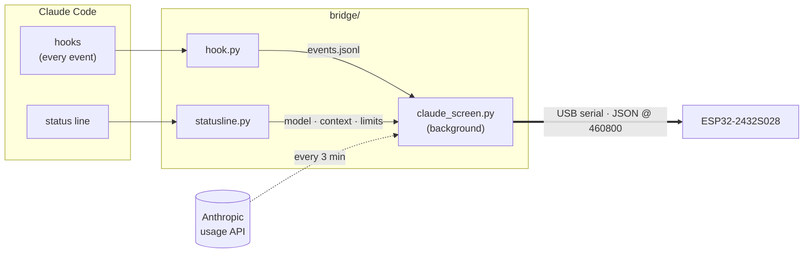

<div align="center">


# ClaudeScreen

**A desk display for Claude Code.** See what Claude is doing, when it needs you,
and how much of your plan you've used, on a $15 ESP32 touchscreen.


</div>

---

## What it shows

<p align="center">
  
</p>

| | |
|---|---|
| **Activity** | The most urgent session up front: *Thinking*, *Editing*, *Running*, *Searching*, *Researching*… with the tool and file or command it's on, and how long it has been at it. |
| **Needs you** | Permission prompts and questions turn the card amber with a pulsing ring, and the LED on the back of the board breathes amber too. |
| **Done** | A green check and the first line of Claude's reply. |
| **Sessions** | One chip per open Claude Code session, coloured by state. Tap the screen to cycle through them. |
| **Context** | How full the focused session's context window is. |
| **Plan usage** | 5-hour and weekly limits as rings, with time until each resets. They turn amber at 75% and red at 90%. |

Text is anti-aliased with Roboto and JetBrains Mono, the spark animates while Claude
works, and the backlight dims itself after 10 quiet minutes.

## How it works



- **`hook.py`** runs async on every Claude Code hook event (prompt, tool use, permission
  request, stop…) and appends a compact line to `~/.claude/claude-screen/events.jsonl`.
  It never blocks or slows Claude Code.
- **`statusline.py`** sits in front of your status line, saving the model, context % and
  rate limits Claude Code passes it, then hands off to your original status line command.
- **`claude_screen.py`** turns those events into per-session state, checks plan usage
  every 3 minutes, and streams a JSON line to the board each second. It finds the board's
  USB port on its own and reconnects if you unplug it.
- **The firmware** draws each frame in 40-pixel strips into two alternating buffers, so a
  full 16-bit frame never has to fit in RAM and each strip is sent to the screen (by DMA)
  while the next one is drawn.

## Hardware

- **ESP32-2432S028**, the "Cheap Yellow Display": 2.8" 320×240 touchscreen.
  Both screen controllers sold under that name are supported: ILI9341 and ST7789 ("CYD2USB").
- A USB cable to your PC.

> [!NOTE]
> Many of these boards can't draw power from a USB-C port with a USB-C to USB-C cable,
> because the two resistors that tell the port to turn on are missing. Plug into USB-A,
> or use a USB-C to USB-A adapter.

## Setup

### 1. Flash the firmware

```bash
pip install platformio
cd firmware
pio run -t upload
```

If the upload says *"Wrong boot mode detected"*, hold the **BOOT** button while it connects.

### 2. Install the bridge

```bash
pip install pyserial
python bridge/install.py
```

This:
- adds async hooks to `~/.claude/settings.json`, backing it up first
- puts the status line tap in front of your existing status line
- adds a hidden launcher to your Windows Startup folder, so the bridge runs at login

Run `python bridge/install.py --remove` to undo all of it.

### 3. Tune the display (if needed)

The firmware tries to detect the panel. If colours look inverted or the picture is
mirrored, change the settings stored on the board. Stop the bridge first:

```bash
python bridge/display_config.py panel=2 inv=1
```

| Setting | Values |
|---|---|
| `panel` | `0` auto · `1` ILI9341 · `2` ST7789 |
| `inv` | `0` auto · `1` normal colours · `2` inverted |
| `rot` | `1` landscape · `3` landscape, flipped (long-press the screen does the same) |
| `bgr` | `1` swaps red and blue |

## Usage

| Command | |
|---|---|
| `python bridge/claude_screen.py` | Run the bridge in a terminal (it normally starts at login) |
| `python bridge/claude_screen.py --demo` | Cycle through demo screens |
| `python bridge/claude_screen.py --shot out.png` | Save a screenshot of what's on the display |
| `python bridge/display_config.py` | Show the board's panel settings |

The background bridge logs to `~/.claude/claude-screen/bridge.log`.

**On the device:** tap to cycle sessions, long-press for 1.5s to rotate 180°.

### About the usage rings

The 5-hour and weekly numbers come from two places, and whichever is newer wins:

1. **The status line.** Claude Code passes rate limits to it in terminal sessions.
2. **Claude Code's usage endpoint**, checked every 3 minutes with the login token in
   `~/.claude/.credentials.json`. The token is only sent to `api.anthropic.com`. That file
   is only refreshed by terminal `claude` sessions, so if you only use the desktop app the
   rings show the last known values until you next run `claude` in a terminal.

The endpoint isn't officially documented, so a Claude Code update could change it.

## Project layout

```
bridge/
  claude_screen.py    background bridge: event tracking, usage checks, serial link
  hook.py             Claude Code hook (async, appends events)
  statusline.py       status line tap
  install.py          installer / uninstaller
  display_config.py   panel settings stored on the board
firmware/
  platformio.ini
  src/main.cpp        rendering, serial protocol, touch, backlight
  src/board.h         LovyanGFX pin map for the CYD
  src/fonts.h         generated anti-aliased fonts
tools/
  make_fonts.py       rasterises TTFs into VLW fonts → fonts.h
  readme_images.py    frames screenshots for this README
```

<details>
<summary><b>Serial protocol</b></summary>

One JSON object per line, PC → board, about once a second:

```json
{
  "t": "14:32",
  "s": [{"n": "ClaudeScreen", "st": "work", "v": "Editing", "d": "Edit main.cpp",
         "a": 134, "c": 42, "m": "Opus 5.5"}],
  "l": {"h5": [23.5, 8040], "d7": [41.0, 302400]}
}
```

| Field | Meaning |
|---|---|
| `s[].st` | `work`, `wait` or `idle` |
| `s[].v` / `d` | headline verb / detail line |
| `s[].a` | seconds in the current state (the board keeps counting) |
| `s[].c` | context window %, `-1` if unknown |
| `l.h5` / `l.d7` | `[used %, seconds until reset]` |

Commands: `{"cmd":"ping"}`, `{"cmd":"shot"}` (sends back `SHOT w h` followed by raw RGB565
pixel data), and `{"cmd":"set", "panel":…, "inv":…, "bgr":…, "rot":…}`.

</details>
